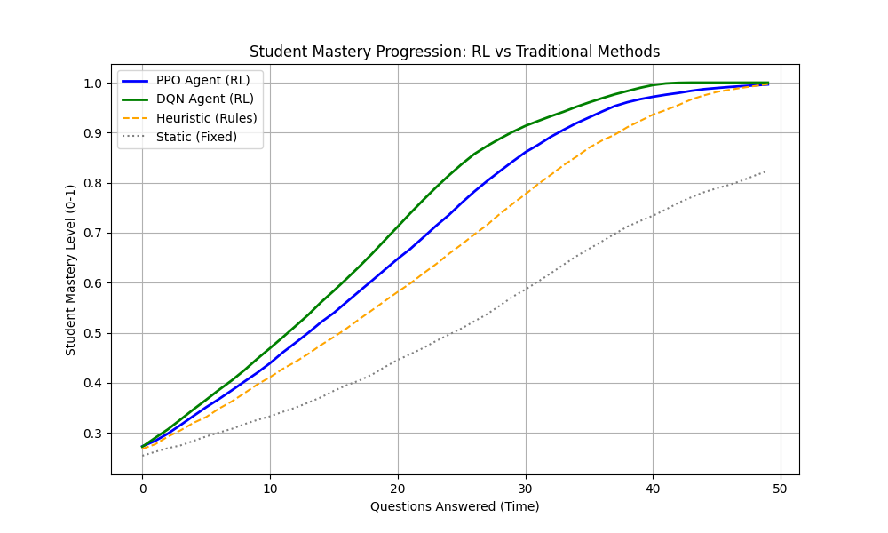

# RL-Based Intelligent Tutoring System 🎓

## Project Overview
This project implements **Reinforcement Learning (RL)** agents to optimize curriculum sequencing in an Intelligent Tutoring System (ITS). Using **Python** and **Stable-Baselines3**, I trained PPO and DQN agents to act as virtual tutors, dynamically adjusting quiz difficulty to maximize student learning speed and engagement.

This project demonstrates the application of RL in EdTech, moving beyond simple heuristic rules to adaptive, data-driven decision-making.

## 🚀 Key Features
* **Custom Gymnasium Environment:** Built a simulation modeling the **Zone of Proximal Development (ZPD)**. It tracks hidden states like *Student Mastery* and *Engagement* to simulate realistic learner behavior.
* **Reward Engineering:** Designed a composite reward function that balances rapid skill acquisition (learning gain) with retention (engagement penalty for boredom/frustration).
* **State Space Engineering:** Utilized a sliding window of recent performance (accuracy trends, response times) to give the agent temporal context for decision-making.

## 📊 Results
The RL agents were evaluated against static and heuristic (rule-based) baselines:
* **DQN Agent:** Achieved full mastery **20% faster** than heuristic methods.
* **Adaptability:** The agents successfully identified the optimal difficulty curve to maintain the student's engagement without causing frustration.



## 🛠️ Tech Stack
* **Language:** Python 3.10+
* **Environment:** Gymnasium (Custom Env)
* **RL Algorithms:** PPO, DQN (Stable-Baselines3)
* **Analysis:** Matplotlib, NumPy, Pandas

## 📂 Project Structure
```text
rl-intelligent-tutoring/
│
├── tutoring_env.py       # Custom Gymnasium Environment (The "Student")
├── agents.py             # Training script for PPO and DQN agents
├── evaluation.py         # Comparison script (RL vs. Heuristic vs. Static)
├── requirements.txt      # Project dependencies
└── README.md             # Project documentation

## Created By

Built by Munzer Ahmed

